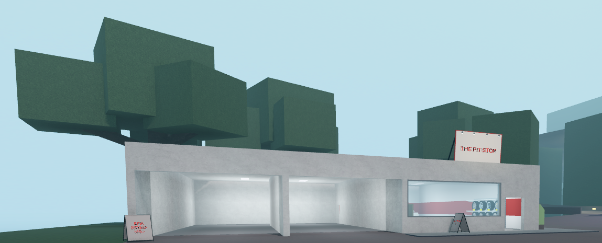

# ATN-Weapons
List of all weapons in the roblox game "A Typical Neighborhood".

## Table of Contents

- [Dustin](#dustin)
    - [Cleaver](#cleaver)
    - [Kitchen Knife](#kitchen-knife)
    - [Metal Bat](#metal-bat)
    - [Ninjato](#ninjato)
    - [Combat Knife](#combat-knife)
    - [Sledgehammer](#sledgehammer)
    - [Wooden bat](#wooden-bat)
    - [Boxing style](#boxing-style)
    - [Shovel](#shovel)
- [Austin](#austin)
- [Beach](#beach)
    - [Signs](#signs)
    - [Spear](#spear)
    - [Temple Sword](#temple-sword)
- [Forest](#forest)
    - [Pipe](#pipe)
    - [Pitchfork](#pitchfork)
    - [Pickaxe](#pickaxe)
    - [Hammer](#hammer)
## Dustin

### Cleaver
Can be located in most of the houses in dustin.

### Kitchen Knife
Just like the cleaver, can be located in most of the houses in dustin, specifically in the kitchen

### Metal Bat

Orange house containing Metal Bat.

Metal Bat on the table.

### Ninjato

Red house containing the ninjato.
The red house can be found in the "residential" area of dustin. Left side, third row.

Ninjato in the bedroom of the red house.

### Combat knife

Red house containing the Combat knife.

Red house containing the combat knife.
The red house can be found in the "residential" area of dustin. Left side, third row.

### Sledgehammer

Construction site the Sledgehammer is found in.

One of few sledge hammer locations inside the construction site.

### Wooden Bat

Dumpster containing the wooden bat, behind the gas station.

Wooden bat spawn location inside of the dumpster

### Boxing Style

Boxing arena which contains the boxing style

The Boxing Style, please note you must have less than 0 or 1 threat to buy, anything higher and you will be unable to obtain the boxing style

### Shovel

Graveyard inside Dustin

Grave where the shovel is obtained

## Austin

## Beach

### Signs

located at the beach, coming off the bridge, to your right, you will see a few buildings, one of which will be a sign shop.

Inside the shops, there are many signs for sale, they can technically be used as weapons

### Spear

Direction the spear is in.

Spear located near the abandoned mines.

### Temple Sword

This is the temple, where the 2 temple sword spawns are.

This is 1 of 2 temple sword spawns.

## Forest

### Pipe

Straying off the main path in the forest, you may find a shack.

Go inside of the hole in the wall.

Go forward more, and you will find the pipe, laying on the ground.

### Pitchfork

Deep in the woods lies a shack, where the pitchforks reside.

Inside of the barn, near the shack, there is a few pitchforks.

### Chainsaw(unfinished section)

Deep in the woods lies a shack, where the silver key resides.

Inside the barn, there is a silver key, pick it up.

While having the key inside ur inventory, click on the doors of the hatch to open them.

### Pickaxe

Deep in the woods, find a cave.

Inside the cave, there will be a shop to buy a pickaxe for 83 bux.

### Hammer

Near the cave entrance, deep in the woods, find a ramp leading upward, to the mountain.

At the top you will find "the pit stop" shop, go inside.

Inside, near the cash register, you will find a hammer for sale for only 36 bux.